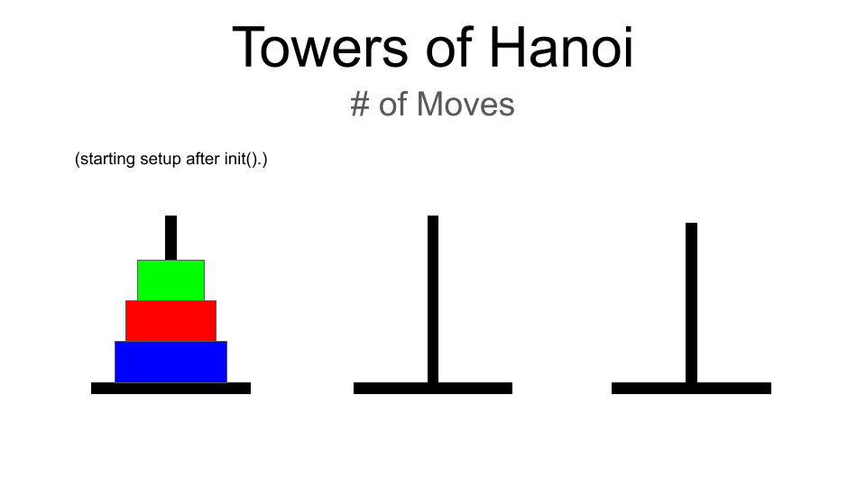
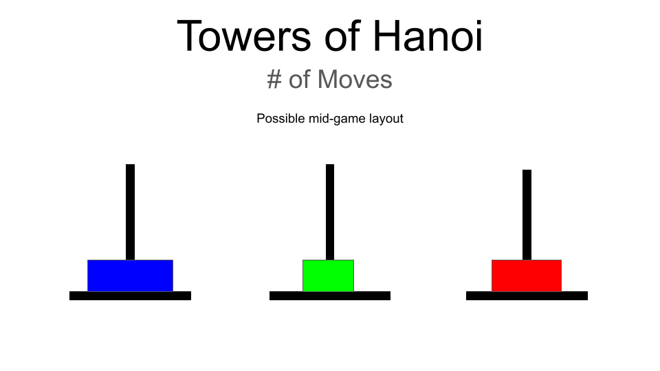
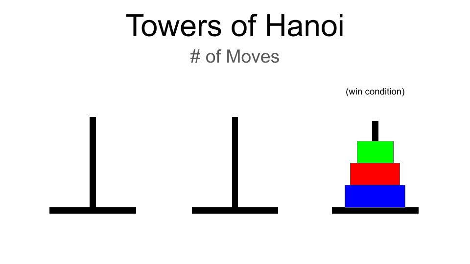

# Towers of Hanoi

## Description

A browser-based Towers of Hanoi game coded in JavaScript, HTML, and CSS.

## Planning
<ul>
    <li>Build out the framework in index.html, script.js, and style.css.</li>
    <li>Link files to index.html</li>
    <li>Wireframe concept for GUI/game logic</li>
    <li>Game logic with minimal GUI</li>
    <li>Clean up code</li>
    <li>Make everything pretty with CSS</li>
</ul>

## User Stories

#### MVP
    -As a user, I want to be able to visualize my moves.
    -As a user, I want the different rings to be easily distinguishable.
    -As a user, I want visual feedback if I attempt to make an illegal move.
    -As a user, I want obvious feedback when I have fulfilled the win conditions for the game.

#### Bronze
    -As a user, I want a reset button to return the game to a default position.
    -As a user, I want to have audio feedback whenever I make a move.
    -As a user, I want to have feedback telling me how many moves I have made.

#### Silver
    -As a user, I want to be able to disable the audio feedback when I move.
    -As a user, I want to be able to select a difficulty level, or to enter the number of rings.

#### Gold
    -As a user, I want to be able to click a button to solve the puzzle for me.

## Wireframe

Starting screen mockup

Midgame screen mockup

Completed game mockup

